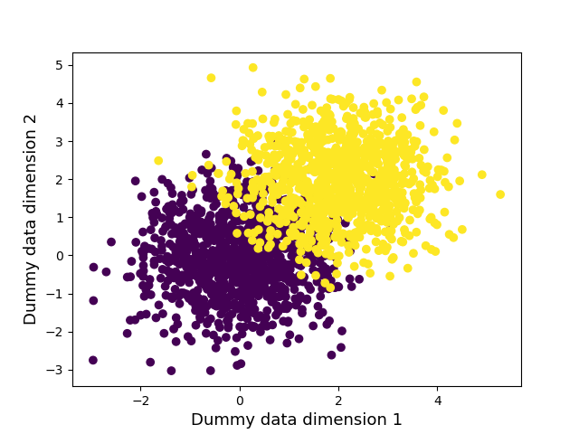
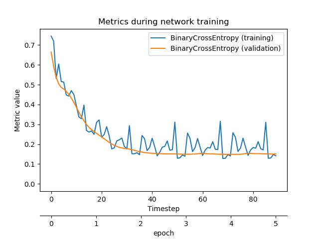
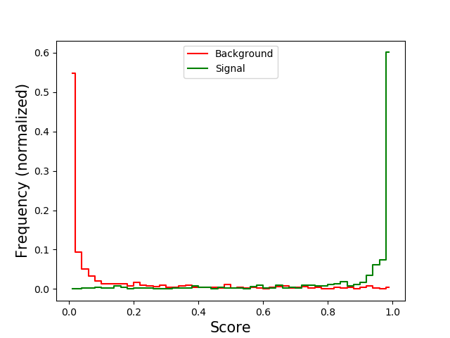
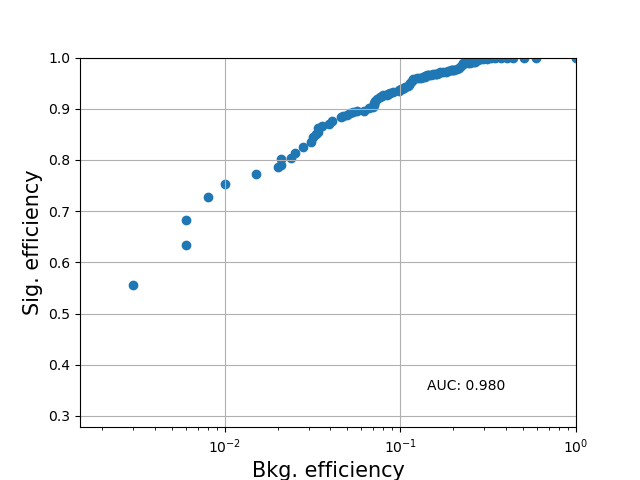

# Minimum working example

### Instructions
Run with `python3 run_example_mwe.py`.

### Generating dummy data
The first part of this script generates some dummy data, that looks as follows (modulo random fluctuations):



There are two classes ('signal' and 'background'), with two features/dimesions (displayed on the x- and y-axis).

### Building the network
The network is defined as follows:

```
N = DenseNetwork()
N.add_layer( DenseLayer(2, 3, 'linear') )
N.add_layer( DenseLayer(3, 1, 'sigmoid') )
N.set_loss_function('binary_crossentropy')
#N.set_optimizer( SGD(learning_rate=0.5, momentum=0.3) )
#N.set_optimizer( RMSprop(learning_rate=0.1) )
N.set_optimizer( Adam(learning_rate=0.05) )
N.set_batch_size(100)
N.set_nepochs(5)
```

### Training the network
The network is trained as follows:

```
N.fit(X_train, labels, validation_fraction=0.1)
```

And the resulting progress looks like this:



### Evaluating the network
The network successfully learned to distinguish the two classes, as is shown in the following figures:



